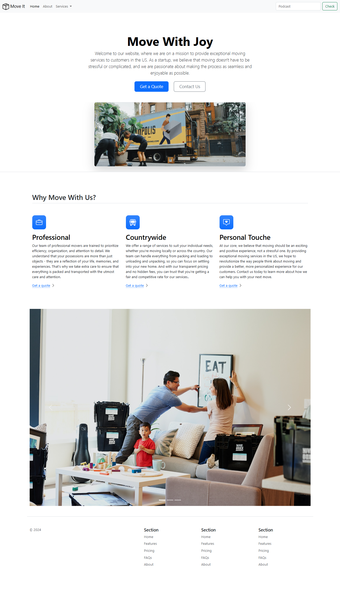

# Bootstrap Example 1 - Responsive Business Website

This repository contains the code for **Bootstrap Example 1**, a responsive and modern business-themed website. Built using HTML, CSS, and Bootstrap, this project demonstrates the use of Bootstrap’s powerful grid and component system to create a professional-looking site.

 <!-- Replace with an actual screenshot link if available -->

## 🌐 Live Demo

Explore the live demo [here](https://abdo-fullstack-projects-2023.github.io/bootstrap_example1/).

## 📋 Features

- **Responsive Layout**: The site is fully responsive, ensuring compatibility across devices of all sizes.
- **Professional Design**: A clean, business-oriented theme with structured sections like About, Services, and Contact.
- **Bootstrap Framework**: Leverages Bootstrap 5 for styling, layouts, and a seamless user experience.

## 🛠️ Technologies Used

- **HTML5**
- **CSS3**
- **Bootstrap 5**

## 📂 Project Structure

```plaintext
├── index.html         # Main HTML file
├── css/               # Custom CSS for additional styling
├── images/            # Image assets used on the website
└── README.md          # Project documentation

